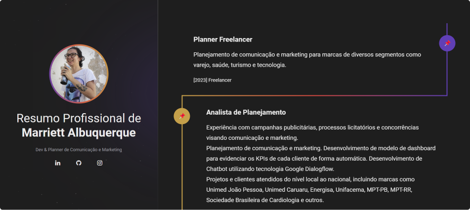

  

# 🖥 Projeto

- Esse é um projeto web responsivo utilizado para exibir um resumo de experiências profisionais em uma timeline.

## 🚀 Tecnologias

- Esse projeto foi desenvolvido utilizando as seguintes teconologias:
  - HTML
  - CSS
  - Git e Github

## 🏷 Layout

Você pode visualizar esse projeto clicando [neste link](https://marriett.github.io/resumo-profissional/).
